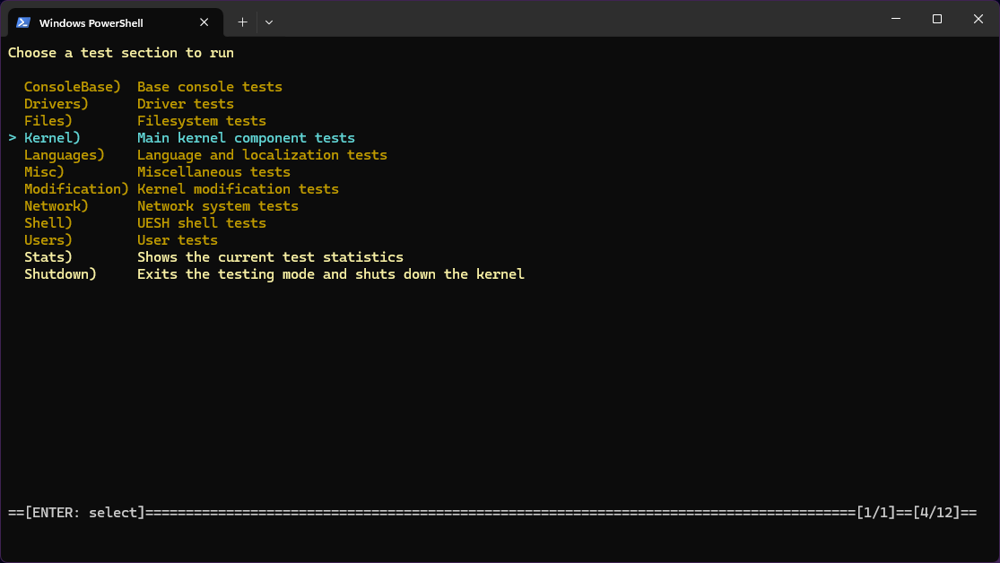
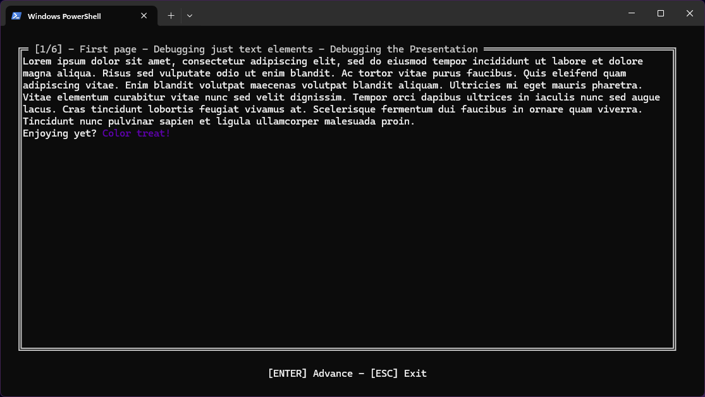

# Testing

<figure><figcaption></figcaption></figure>

Another way to diagnose the kernel is through testing. It uses the facade system to allow you to test individual kernel features. It can be invoked by running Nitrocid KS with the `testInteractive` command-line argument.

## Controls

In the main screen, it shows you all the available test facades, with the four below options:

* `Test All`: Tests all the facades
* `Stats`: Shows how many tests are run and how many tests are yet to run, including failed tests
* `Shutdown`: ︎Exits the test environment and shuts the kernel down

Pressing ENTER will run a test facade and gives you an option to see whether the test succeeded or failed at the end of the test. These options are given to you, as per your judgment:

* `y`: Declares the test as successful (`TestStatus.Success`)
* `n`: Declares the test as failed (`TestStatus.Failed`)
* `r`: Retries the test

## How it works?

<figure><figcaption></figcaption></figure>

The interactive test contains facades, each contained in the internal `TestFacade` class. It contains a status, a name, and a method to run the facade under an overridable `Run()` method.

Each facade have their individual values set. Their statuses are initially set to `TestStatus.Neutral`, which indicates that the test hasn't been run yet.

The interactive test runs a facade using the internal `RunFacade()` method that handles both running the facade itself and an option to judge whether the test succeeded or failed. It also gives you an option whether to repeat the test.


If the test facade is set to compare between the expected value (`TestExpectedValue`) and the actual value (`TestActualValue`), the interactive tester will compare the equality of the values, and judges whether the test succeeded or failed.

