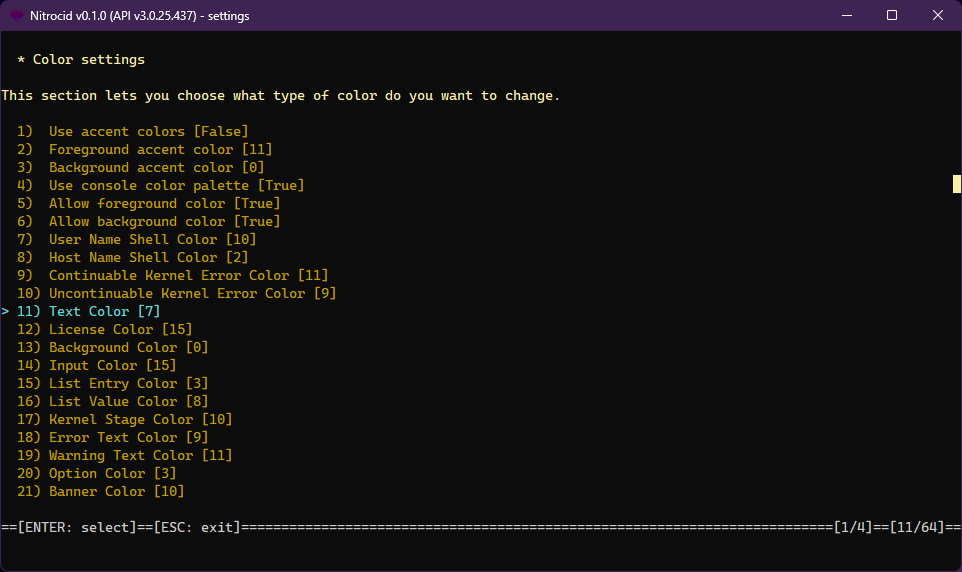
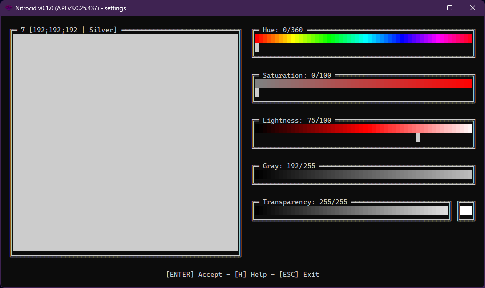
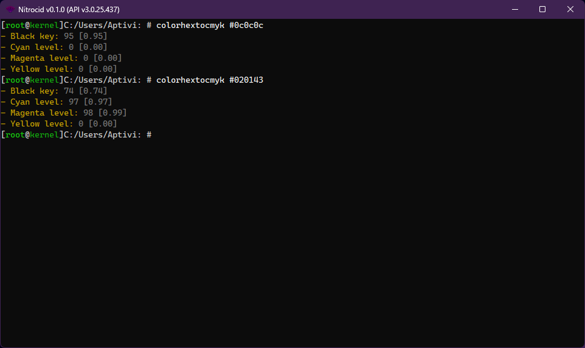

# Color Internals

<figure><figcaption></figcaption></figure>

Nitrocid KS uses Terminaux to manipulate with the colors and configure them for the kernel to use. The kernel employs several of the color types for the kernel components, your addons, or your mods to use when writing text using the Nitrocid's console writer.

The `ConsoleBase` namespace contains a namespace dedicated to color management called `Colors` that contains a plenty of useful tools for kernel color manipulation. Currently, it contains the following classes:

* `KernelColorConversionTools`
* `KernelColorTools`

It also contains the following enumerations for different tools:

* `KernelColorSetErrorReasons`
* `KernelColorType`

Scroll down in this page to get started with the list of amazing color tools. For the general color tools, you may consult the Terminaux manual:


[Terminaux - Manual](https://app.gitbook.com/o/fj052nYlsxW9IdL3bsZj/s/G0KrE9Uk2AiblqjWtpAo/)


## Color types

Nitrocid KS provides you with the following color types to help you make an inspiring theme with nice colors for each type:

| Type                                  | Description                                                 |
| ------------------------------------- | ----------------------------------------------------------- |
| `Input`                               | Input text                                                  |
| `License`                             | License color                                               |
| `ContKernelError`                     | Continuable kernel panic text (usually sync'd with Warning) |
| `UncontKernelError`                   | Uncontinuable kernel panic text (usually sync'd with Error) |
| `HostNameShell`                       | Host name color                                             |
| `UserNameShell`                       | User name color                                             |
| `Background`                          | Background color                                            |
| `NeutralText`                         | Neutral text (for general purposes)                         |
| `ListEntry`                           | List entry text                                             |
| `ListValue`                           | List value text                                             |
| `Stage`                               | Stage text                                                  |
| `Error`                               | Error text                                                  |
| `Warning`                             | Warning text                                                |
| `Option`                              | Option text                                                 |
| `Banner`                              | Banner text                                                 |
| `NotificationTitle`                   | Notification title text                                     |
| `NotificationDescription`             | Notification description text                               |
| `NotificationProgress`                | Notification progress text                                  |
| `NotificationFailure`                 | Notification failure text                                   |
| `Question`                            | Question text                                               |
| `Success`                             | Success text                                                |
| `UserDollar`                          | User dollar sign on shell text                              |
| `Tip`                                 | Tip text                                                    |
| `SeparatorText`                       | Separator text                                              |
| `Separator`                           | Separator color                                             |
| `ListTitle`                           | List title text                                             |
| `DevelopmentWarning`                  | Development warning text                                    |
| `StageTime`                           | Stage time text                                             |
| `Progress`                            | General progress text                                       |
| `BackOption`                          | Back option text                                            |
| `LowPriorityBorder`                   | Low priority notification border color                      |
| `MediumPriorityBorder`                | Medium priority notification border color                   |
| `HighPriorityBorder`                  | High priority notification border color                     |
| `TableSeparator`                      | Table separator                                             |
| `TableHeader`                         | Table header                                                |
| `TableValue`                          | Table value                                                 |
| `SelectedOption`                      | Selected option                                             |
| `AlternativeOption`                   | Alternative option                                          |
| `WeekendDay`                          | Weekend day                                                 |
| `EventDay`                            | Event day                                                   |
| `TableTitle`                          | Table title                                                 |
| `TodayDay`                            | Today                                                       |
| `TuiBackground`                       | Interactive TUI background color                            |
| `TuiForeground`                       | Interactive TUI foreground color                            |
| `TuiPaneBackground`                   | Interactive TUI pane background color                       |
| `TuiPaneSeparator`                    | Interactive TUI pane separator color                        |
| `TuiPaneSelectedSeparator`            | Interactive TUI pane selected separator color               |
| `TuiPaneSelectedItemFore`             | Interactive TUI pane selected item color (foreground)       |
| `TuiPaneSelectedItemBack`             | Interactive TUI pane selected item color (background)       |
| `TuiPaneItemFore`                     | Interactive TUI pane item color (foreground)                |
| `TuiPaneItemBack`                     | Interactive TUI pane item color (background)                |
| `TuiOptionBackground`                 | Interactive TUI option background color                     |
| `TuiKeyBindingOption`                 | Interactive TUI key binding in option color                 |
| `TuiOptionForeground`                 | Interactive TUI option foreground color                     |
| `TuiBoxBackground`                    | Interactive TUI box background color                        |
| `TuiBoxForeground`                    | Interactive TUI box foreground color                        |
| `DisabledOption`                      | Disabled option color                                       |
| `TuiKeyBindingBuiltinBackgroundColor` | Interactive TUI builtin key binding background color        |
| `TuiKeyBindingBuiltinForegroundColor` | Interactive TUI builtin key binding foreground color        |
| `TuiKeyBindingBuiltinColor`           | Interactive TUI builtin key binding color                   |

## Color selector

<figure><figcaption></figcaption></figure>

The color selector is an interactive TUI that allows you to seamlessly select your favorite color, while getting information about it in the main screen, such as the converted color models, the color levels, and more.

To get information about how to use it, you can find it in the Terminaux manual page:


[Color Wheel](https://app.gitbook.com/s/G0KrE9Uk2AiblqjWtpAo/usage/input-reader/other-input/color-wheel)


## Color conversion

<figure><figcaption></figcaption></figure>

Your theme files can also support any specifier, as long as the specifier is supported by Terminaux. For a quick reminder, Terminaux supports the true-color specifiers, alongside the color name or the color number, if you intend to use another color model to select colors.

The commands provided by the color conversion Extras addon help you convert from a color model, such as RGB, to another color model, such as CMYK.

`KernelColorConversionTools` provides you all possible conversion methods to convert a color model to another color model to generate appropriate color specifiers converted to the target unit to create new `Color` instances for your mod's appearance.

For example, if you have Cyan, Magenta, and Yellow values and you want a hex code of it, you can use one of the following function overloads of `ConvertFromCmykToHex()`:

* `ConvertFromCmykToHex(int C, int M, int Y, int K)`
* `ConvertFromCmykToHex(string CMYKSequence)`

## Resetting colors

If you need to reset the colors for further text to be written to the console in its natural colors, you can use the `ResetColors()` function in the `KernelColorTools` class to reset the foreground and the background colors to their defaults.

```csharp
public static void ResetColors(bool useKernelColors = false)
```

Additionally, if you pass `true` to the `useKernelColors` parameter, the colors will be reset to the neutral text color for the foreground color and the kernel background color for the background color.
