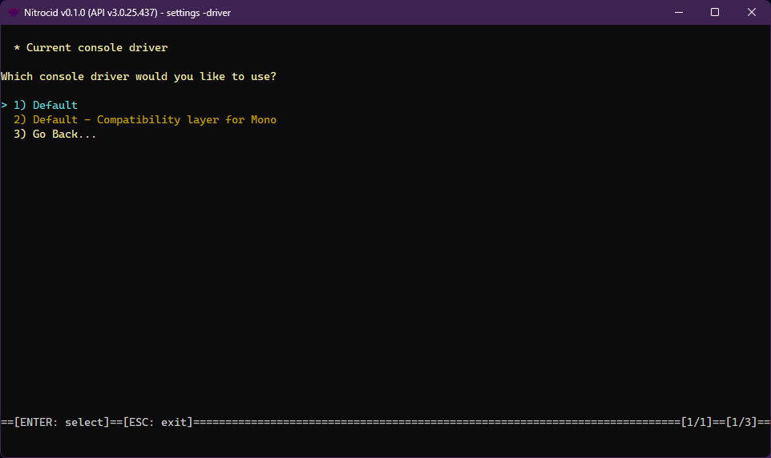

# Console Drivers

<figure><figcaption></figcaption></figure>

The console driver is one of the supported driver types on Nitrocid KS. These drivers allow you to change how the console works, thus earning dynamic console improvements, such as providing better workarounds to perform certain console functions, providing code to speed up the console, and much more.

The console drivers have the following characteristics:

* Interface: `IConsoleDriver`
* Base class: `BaseConsoleDriver`

The console drivers have the following functions that you can optionally override below:


```csharp
bool IsDumb { get; }
bool MovementDetected { get; }
void WritePlain();
void WritePlain(string Text, bool Line, params object[] vars);
void WriteSlowlyPlain(string msg, bool Line, double MsEachLetter, params object[] vars);
void WriteWherePlain(string msg, int Left, int Top, params object[] vars);
void WriteWherePlain(string msg, int Left, int Top, bool Return, params object[] vars);
void WriteWherePlain(string msg, int Left, int Top, bool Return, int RightMargin, params object[] vars);
string RenderWherePlain(string msg, int Left, int Top, params object[] vars);
string RenderWherePlain(string msg, int Left, int Top, bool Return, params object[] vars);
string RenderWherePlain(string msg, int Left, int Top, bool Return, int RightMargin, params object[] vars);
void WriteWhereSlowlyPlain(string msg, bool Line, int Left, int Top, double MsEachLetter, params object[] vars);
void WriteWhereSlowlyPlain(string msg, bool Line, int Left, int Top, double MsEachLetter, bool Return, params object[] vars);
void WriteWhereSlowlyPlain(string msg, bool Line, int Left, int Top, double MsEachLetter, bool Return, int RightMargin, params object[] vars);
void WriteWrappedPlain(string Text, bool Line, params object[] vars);
int CursorLeft { get; set; }
int CursorTop { get; set; }
int WindowWidth { get; }
int WindowHeight { get; }
int WindowTop { get; }
int BufferWidth { get; }
int BufferHeight { get; }
bool CursorVisible { set; }
bool TreatCtrlCAsInput { get; set; }
TextEncoding OutputEncoding { get; set; }
TextEncoding InputEncoding { get; set; }
bool KeyAvailable { get; }
void Clear(bool loadBack = false);
void SetCursorPosition(int left, int top);
void ResetColor();
Stream OpenStandardInput();
Stream OpenStandardOutput();
Stream OpenStandardError();
void SetOut(TextWriter newOut);
void Beep();
ConsoleKeyInfo ReadKey(bool intercept = false);
void Write(char value);
void Write(string text);
void Write(string text, params object[] args);
void WriteLine();
void WriteLine(string text);
void WriteLine(string text, params object[] args);
```


The `ConsoleDriverTools` class contains tools to get all the console drivers and their names and set a console driver as a default. The driver management tools also allow you to do the same thing, though you'll have to specify the driver type.
