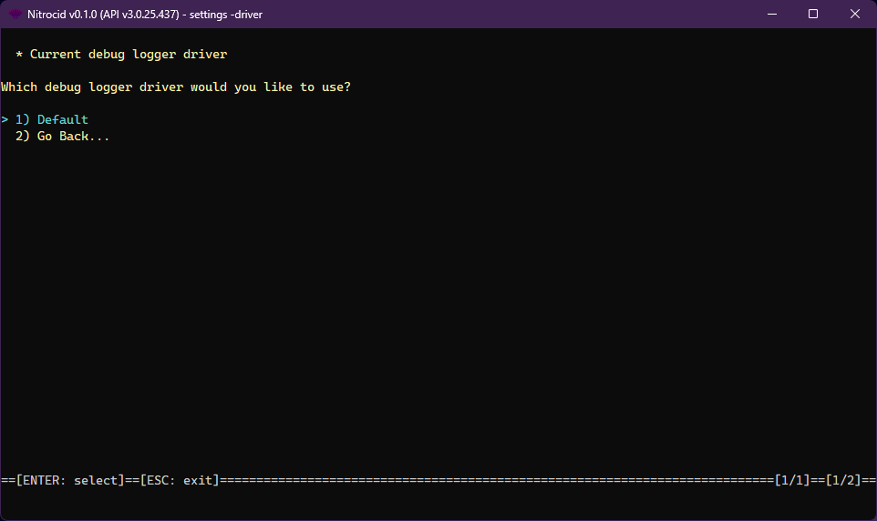

# Debug Logger Drivers

<figure><figcaption></figcaption></figure>

The debug logger driver is one of the supported driver types on Nitrocid KS. These drivers allow you to change how the debug logger works, thus earning dynamic debug logging.

The console drivers have the following characteristics:

* Interface: `IDebugLoggerDriver`
* Base class: `BaseDebugLoggerDriver`

The debug logger drivers have the following functions that you can optionally override below:


```csharp
void Write(string text);
void Write(string text, params object[] vars);
```


The `DebugLoggerDriverTools` class contains tools to get all the debug logger drivers and their names and set a debug logger driver as a default. The driver management tools also allow you to do the same thing, though you'll have to specify the driver type.
