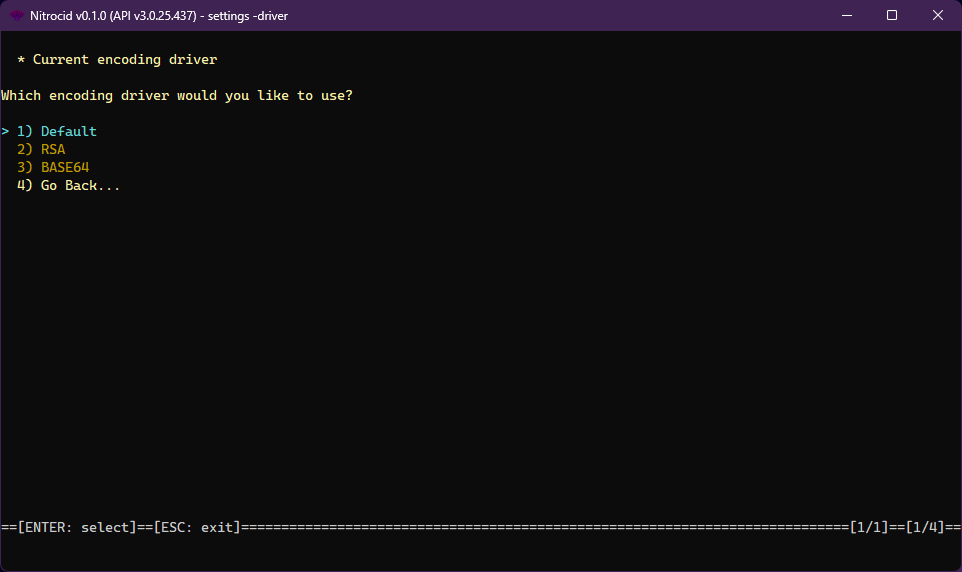

# Encoding Drivers

<figure><figcaption></figcaption></figure>

The encoding driver is one of the supported driver types on Nitrocid KS. These drivers allow you to change how the encoding works, thus earning dynamic encoding based on your selected encoding algorithms.

The console drivers have the following characteristics:

* Interface: `IEncodingDriver` (symmetric) or `IEncodingAsymmetricDriver` (asymmetric)
* Base class: `BaseEncodingDriver` (symmetric) or `BaseEncodingAsymmetricDriver` (asymmetric)

The encoding drivers have the following functions that you can optionally override below:


```csharp
// Below two properties are not available in the asymmetric driver
byte[] Key { get; }
byte[] Iv { get; }

// Available globally
object Instance { get; }
void Initialize();
byte[] GetEncodedString(string text);
string GetDecodedString(byte[] encoded);
byte[] GetEncodedString(string text, byte[] key, byte[] iv);
string GetDecodedString(byte[] encoded, byte[] key, byte[] iv);
byte[] ComposeBytesFromString(string encoded);
string DecomposeBytesFromString(byte[] encoded);
void EncodeFile(string path);
void DecodeFile(string path);
void EncodeFile(string path, byte[] key, byte[] iv);
void DecodeFile(string path, byte[] key, byte[] iv);
bool TryRepresentAsText(byte[] encoded, out string strEncoded);
```


The `EncodingDriverTools` class contains tools to get all the encoding drivers and their names and set an encoding driver as a default. The driver management tools also allow you to do the same thing, though you'll have to specify the driver type.
