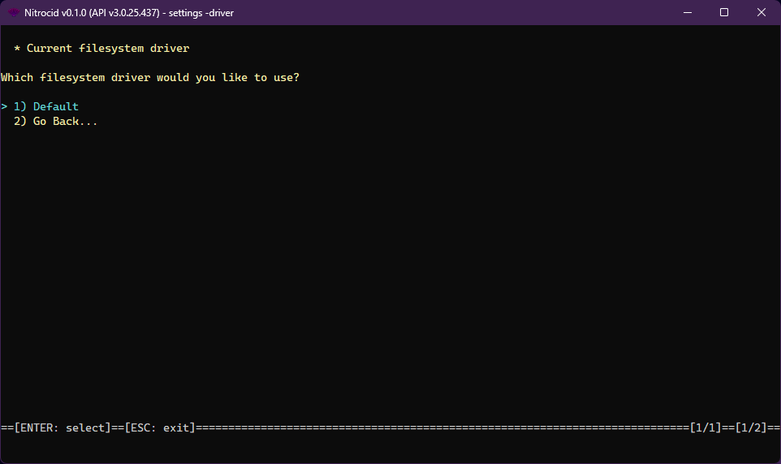

# Filesystem Drivers

<figure><figcaption></figcaption></figure>

The filesystem driver is one of the supported driver types on Nitrocid KS. These drivers allow you to change how the filesystem works, thus earning dynamic filesystem improvements, such as providing better workarounds to perform certain console functions, providing code to speed up the console, and much more.

The console drivers have the following characteristics:

* Interface: `IFilesystemDriver`
* Base class: `BaseFilesystemDriver`

The filesystem drivers have the following functions that you can optionally override below:


```csharp
void AddAttributeToFile(string FilePath, FileAttributes Attributes);
void RemoveAttributeFromFile(string FilePath, FileAttributes Attributes);
List<FileSystemEntry> CreateList(string folder, bool Sorted = false, bool Recursive = false);
string SortSelector(FileSystemEntry FileSystemEntry, int MaxLength);
string[] GetFilesystemEntries(string Path, bool IsFile = false, bool Recursive = false);
string[] GetFilesystemEntries(string Parent, string Pattern, bool Recursive = false);
string[] GetFilesystemEntriesRegex(string Parent, string Pattern, bool Recursive = false);
void ConvertLineEndings(string TextFile);
void ConvertLineEndings(string TextFile, FilesystemNewlineStyle LineEndingStyle);
FilesystemNewlineStyle GetLineEndingFromFile(string TextFile);
string[] CombineTextFiles(string Input, string[] TargetInputs);
byte[] CombineBinaryFiles(string Input, string[] TargetInputs);
void CopyFileOrDir(string Source, string Destination);
void CopyDirectory(string Source, string Destination);
void CopyDirectory(string Source, string Destination, bool ShowProgress);
void CopyFile(string Source, string Destination);
void MakeDirectory(string NewDirectory, bool ThrowIfDirectoryExists = true);
void MakeFile(string NewFile, bool ThrowIfFileExists = true);
void MakeJsonFile(string NewFile, bool ThrowIfFileExists = true, bool useArray = false);
void MakeSymlink(string linkName, string target);
void MoveFileOrDir(string Source, string Destination);
void MoveDirectory(string Source, string Destination);
void MoveDirectory(string Source, string Destination, bool ShowProgress);
void MoveFile(string Source, string Destination);
void RemoveDirectory(string Target);
void RemoveDirectory(string Target, bool ShowProgress, bool secureRemove = false);
void RemoveFile(string Target, bool secureRemove = false);
void RemoveFileOrDir(string Target, bool secureRemove = false);
List<string> GetPathList();
string GetRandomFileName();
string GetRandomFolderName();
void AddToPathLookup(string Path);
void AddToPathLookup(string Path, string RootPath);
void RemoveFromPathLookup(string Path);
void RemoveFromPathLookup(string Path, string RootPath);
bool FileExistsInPath(string FilePath, ref string Result);
void PrintDirectoryInfo(FileSystemEntry DirectoryInfo);
void PrintDirectoryInfo(FileSystemEntry DirectoryInfo, bool ShowDirectoryDetails);
void PrintFileInfo(FileSystemEntry FileInfo);
void PrintFileInfo(FileSystemEntry FileInfo, bool ShowFileDetails);
void PrintContents(string filename);
void PrintContents(string filename, bool PrintLineNumbers, bool ForcePlain = false);
string RenderContents(string filename);
string RenderContents(string filename, bool PrintLineNumbers, bool ForcePlain = false);
void DisplayInHex(long StartByte, long EndByte, byte[] FileByte);
void DisplayInHex(byte ByteContent, bool HighlightResults, long StartByte, long EndByte, byte[] FileByte);
void DisplayInHexDumbMode(long StartByte, long EndByte, byte[] FileByte);
void DisplayInHexDumbMode(byte ByteContent, bool HighlightResults, long StartByte, long EndByte, byte[] FileByte);
string RenderContentsInHex(long StartByte, long EndByte, byte[] FileByte);
string RenderContentsInHex(byte ByteContent, bool HighlightResults, long StartByte, long EndByte, byte[] FileByte);
string RenderContentsInHex(long ByteHighlight, long StartByte, long EndByte, byte[] FileByte);
bool FileExists(string File, bool Neutralize = false);
bool FolderExists(string Folder, bool Neutralize = false);
bool Exists(string Path, bool Neutralize = false);
bool Rooted(string Path);
string GetNumberedFileName(string path, string fileName);
char[] GetInvalidPathChars();
bool TryParsePath(string Path);
bool TryParseFileName(string Name);
bool IsBinaryFile(string Path);
bool IsJson(string Path);
bool IsSql(string Path);
List<string> SearchFileForString(string FilePath, string StringLookup);
List<string> SearchFileForStringRegexp(string FilePath, Regex StringLookup);
List<(string, MatchCollection)> SearchFileForStringRegexpMatches(string FilePath, Regex StringLookup);
long GetAllSizesInFolder(DirectoryInfo DirectoryInfo);
long GetAllSizesInFolder(DirectoryInfo DirectoryInfo, bool FullParseMode);
string[] ReadContents(string filename);
string[] ReadAllLinesNoBlock(string path);
string ReadContentsText(string filename);
string ReadAllTextNoBlock(string path);
byte[] ReadAllBytes(string path);
byte[] ReadAllBytesNoBlock(string path);
void WriteContents(string filename, string[] contents);
void WriteAllLinesNoBlock(string path, string[] contents);
void WriteContentsText(string filename, string contents);
void WriteAllTextNoBlock(string path, string contents);
void WriteAllBytes(string path, byte[] contents);
void WriteAllBytesNoBlock(string path, byte[] contents);
void ClearFile(string path);
string ReadToEndAndSeek(ref StreamReader stream);
void WrapTextFile(string path);
void WrapTextFile(string path, int columns);
(int line, string one, string two)[] Compare(string pathOne, string pathTwo);
```


The `FilesystemDriverTools` class contains tools to get all the filesystem drivers and their names and set a filesystem driver as a default. The driver management tools also allow you to do the same thing, though you'll have to specify the driver type.
