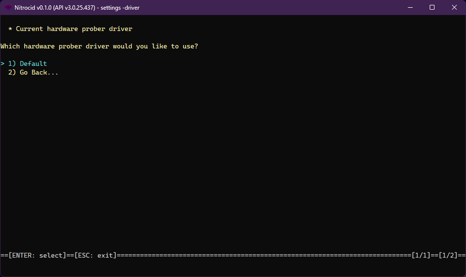

# Hardware Prober Drivers

<figure><figcaption></figcaption></figure>

The hardware prober driver is one of the supported driver types on Nitrocid KS. These drivers allow you to change how the hardware prober works, thus earning dynamic hardware prober improvements.

The hardware prober drivers have the following characteristics:

* Interface: `IHardwareProberDriver`
* Base class: `BaseHardwareProberDriver`

The hardware prober drivers have the following functions that you can optionally override below:


```csharp
string[] SupportedHardwareTypes { get; }
IEnumerable ProbeProcessor();
IEnumerable ProbePcMemory();
IEnumerable ProbeGraphics();
IEnumerable ProbeHardDrive();
void ListHardware();
void ListHardware(IEnumerable processors, IEnumerable memory, IEnumerable graphics, IEnumerable hardDrives);
void ListHardware(string hardwareType);
string ListDiskPartitions(int diskIndex);
string ListDisks();
string DiskInfo(int diskIndex);
string DiskPartitionInfo(int diskIndex, int diskPartitionIndex);
```


The `HardwareProberDriverTools` class contains tools to get all the hardware prober drivers and their names and set a hardware prober driver as a default. The driver management tools also allow you to do the same thing, though you'll have to specify the driver type.
