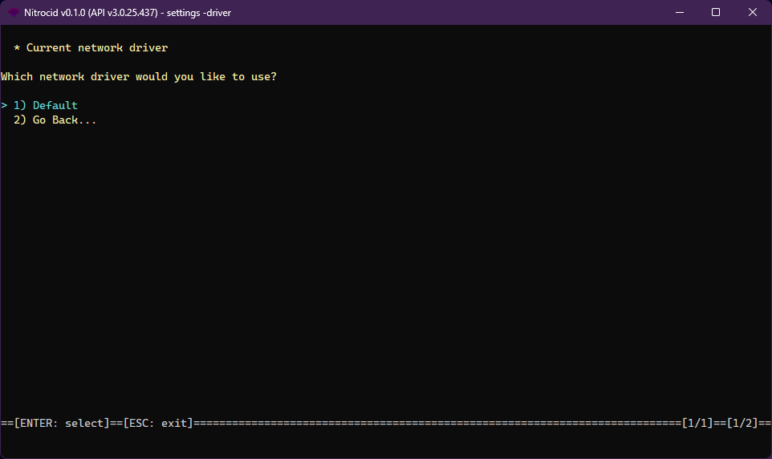

# Network Drivers

<figure><figcaption></figcaption></figure>

The network driver is one of the supported driver types on Nitrocid KS. These drivers allow you to change how the network works, thus earning dynamic network improvements, such as providing better methods to perform network operations.

The network drivers have the following characteristics:

* Interface: `INetworkDriver`
* Base class: `BaseNetworkDriver`

The network drivers have the following functions that you can optionally override below:


```csharp
bool NetworkAvailable { get; }
PingReply PingAddress(string Address, int Timeout, byte[] Buffer);
string GetFilenameFromUrl(string Url);
bool DownloadFile(string URL);
bool DownloadFile(string URL, bool ShowProgress);
bool DownloadFile(string URL, string FileName);
bool DownloadFile(string URL, bool ShowProgress, string FileName);
bool UploadFile(string FileName, string URL);
bool UploadFile(string FileName, string URL, bool ShowProgress);
string DownloadString(string URL);
string DownloadString(string URL, bool ShowProgress);
bool UploadString(string URL, string Data);
bool UploadString(string URL, string Data, bool ShowProgress);
IPAddress[] GetOnlineDevicesInNetwork();
```


The `NetworkDriverTools` class contains tools to get all the network drivers and their names and set a network driver as a default. The driver management tools also allow you to do the same thing, though you'll have to specify the driver type.
