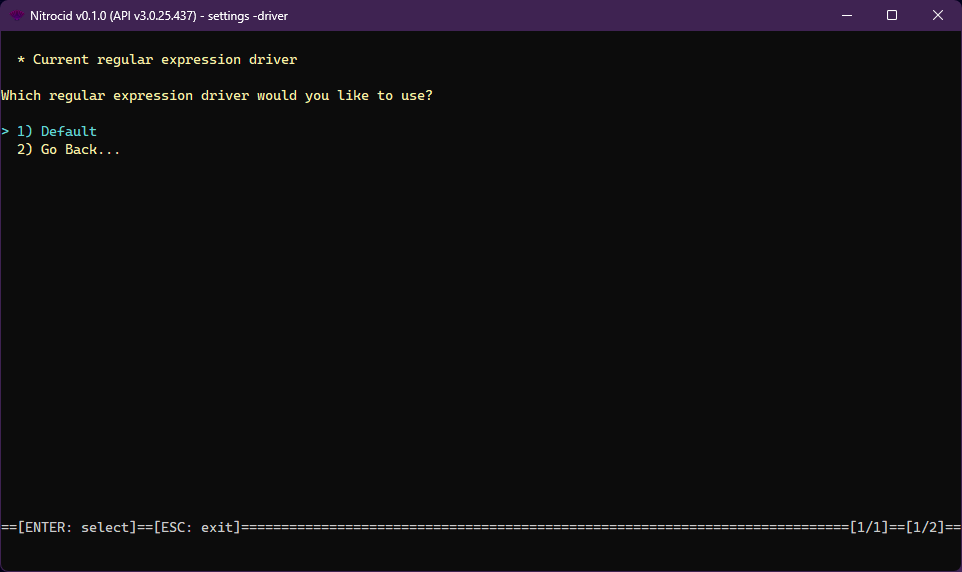

# Regular Expression Drivers

<figure><figcaption></figcaption></figure>

The regular expression driver is one of the supported driver types on Nitrocid KS. These drivers allow you to change how the regular expression works, thus earning dynamic regular expression improvements.

The regular expression drivers have the following characteristics:

* Interface: `IRegexpDriver`
* Base class: `BaseRegexpDriver`

The regular expression drivers have the following functions that you can optionally override below:


```csharp
bool IsValidRegex([StringSyntax(StringSyntaxAttribute.Regex)] string pattern);
bool IsMatch(string text, [StringSyntax(StringSyntaxAttribute.Regex)] string pattern);
Match Match(string text, [StringSyntax(StringSyntaxAttribute.Regex)] string pattern);
MatchCollection Matches(string text, [StringSyntax(StringSyntaxAttribute.Regex)] string pattern);
string Filter(string text, [StringSyntax(StringSyntaxAttribute.Regex)] string pattern);
string Filter(string text, [StringSyntax(StringSyntaxAttribute.Regex)] string pattern, string replaceWith);
string[] Split(string text, [StringSyntax(StringSyntaxAttribute.Regex)] string pattern);
string Escape(string text);
string Unescape(string text);
```


The `RegexpDriverTools` class contains tools to get all the regular expression drivers and their names and set a regular expression driver as a default. The driver management tools also allow you to do the same thing, though you'll have to specify the driver type.
