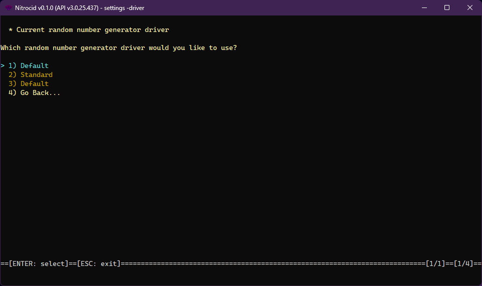

# RNG Drivers

<figure><figcaption></figcaption></figure>

The random number generator driver is one of the supported driver types on Nitrocid KS. These drivers allow you to change how the random number generator works, thus earning dynamic random number generator improvements, such as providing faster methods to get random numbers.

The random number generator drivers have the following characteristics:

* Interface: `IRandomDriver`
* Base class: `BaseRandomDriver`

The random number generator drivers have the following functions that you can optionally override below:


```csharp
int Random();
int Random(int max);
int Random(int min, int max);
short RandomShort();
short RandomShort(short max);
short RandomShort(short min, short max);
int RandomIdx();
int RandomIdx(int max);
int RandomIdx(int min, int max);
double RandomDouble();
double RandomDouble(double max);
bool RandomChance(double prob);
bool RandomChance(int probPercent);
bool RandomRussianRoulette();
bool RandomBoolean();
```


The `RandomDriverTools` class contains tools to get all the random number generator drivers and their names and set a random number generator driver as a default. The driver management tools also allow you to do the same thing, though you'll have to specify the driver type.
