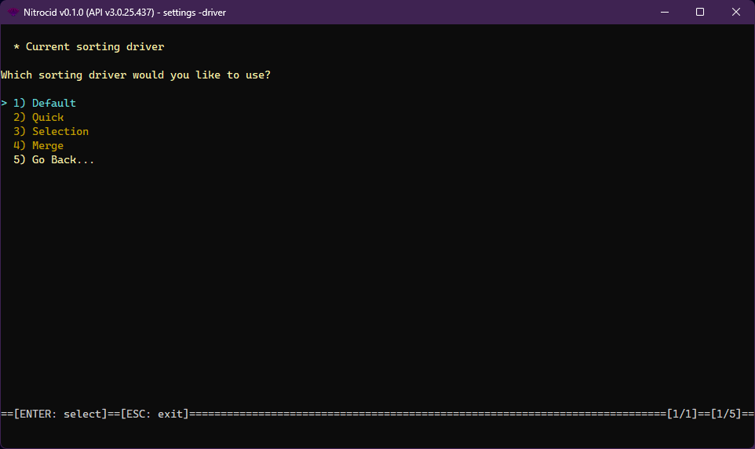

# Sorting Drivers

<figure><figcaption></figcaption></figure>

The sorting driver is one of the supported driver types on Nitrocid KS. These drivers allow you to change how the sorting works, thus earning dynamic sorting improvements, such as providing fast and efficient array sorting code.

The sorting drivers have the following characteristics:

* Interface: `ISortingDriver`
* Base class: `BaseSortingDriver`

The sorting drivers have the following functions that you can optionally override below:


```csharp
byte[] SortNumbersInt8(byte[] unsorted);
short[] SortNumbersInt16(short[] unsorted);
int[] SortNumbersInt32(int[] unsorted);
long[] SortNumbersInt64(long[] unsorted);
Int128[] SortNumbersInt128(Int128[] unsorted);
float[] SortNumbersFloat(float[] unsorted);
double[] SortNumbersDouble(double[] unsorted);
```


The `SortingDriverTools` class contains tools to get all the sorting drivers and their names and set a sorting driver as a default. The driver management tools also allow you to do the same thing, though you'll have to specify the driver type.
