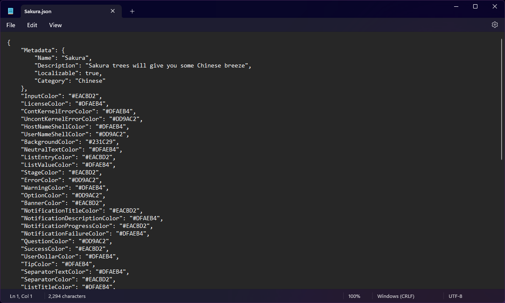
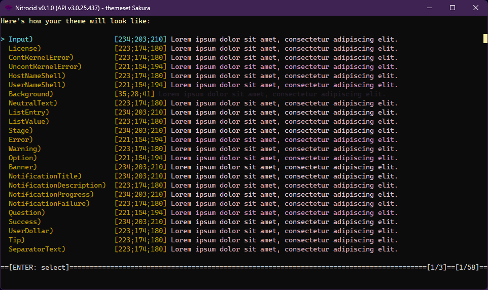
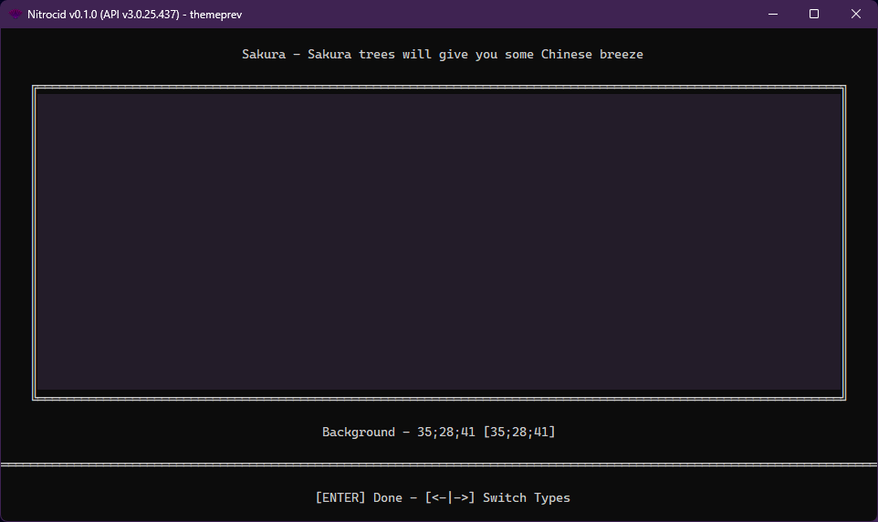

# Theme Internals

<figure><figcaption></figcaption></figure>

Nitrocid KS first came with color theme support in the fourth major version, 0.0.4, but only supported 16 colors defined by the `ConsoleColor` enumeration. Since then, various themes have been added to the point that we once reached 95+ themes before going down to 65+ themes.

Themes for the kernel consist of color information for each kernel color type. They are made with a simple JSON syntax that's easy to use. Here's the format of each theme JSON file:

```json
{
    "Metadata": {
        "Name": "Theme name",
        "Description": "This is my theme",
        "IsEvent": false,
        "StartMonth": 2,
        "StartDay": 1,
        "EndMonth": 2,
        "EndDay": 22,
        "Calendar": "Gregorian",
        "Category": "Exciting",
        "UseAccentTypes": [
            "LicenseColor",
            (...)
        ],
        "Localizable": true
    },
    "InputColor": "15",
    "LicenseColor": "15",
    "ContKernelErrorColor": "15",
    (...)
}
```

We'll explain things one by one. The `Metadata` key consists of some basic information about the theme, like the name and the description. Themes can also be event-based by setting the appropriate property.

* `Name`: Display name of the theme
* `Description`: Short and concise description of the theme
* `IsEvent`: Indicates whether the theme is for a specific event (holidays, celebrations, etc.) **\[optional]**
* `StartMonth`: The month in which the event starts **\[optional]**
* `StartDay`: The day in which the event starts **\[optional]**
* `EndMonth`: The month in which the event ends **\[optional]**
* `EndDay`: The day in which the event ends **\[optional]**
* `Calendar`: The calendar to use, such as Hijri, Chinese, etc. **\[optional]**
* `Category`: The category to use, such as Mesmerizing, Exciting, etc. **\[optional]**
* `UseAccentTypes`: The color types which the theme management will switch their values with the accent color configurable by the user from the kernel settings **\[optional]**
* `Localizable`: Whether the description is localizable **\[internal, optional]**


The following color categories are supported:

* `Miscellaneous`: Themes that don't fit in the available categories
* `Aesthetic`: Aesthetically beautiful themes
* `Chinese`: Themes that are based on the Chinese culture
* `Exciting`: Themes that make you excited
* `Mesmerizing`: Mesmerizing and relaxing themes
* `Standard`: Standard themes (usually housing the first themes ever released)
* `Linux`: Linux flavor themes


What follows the metadata is a list of available kernel color types and their color representations using Terminaux's supported color formats, which are linked in the below page:


[Color Sequences](https://app.gitbook.com/s/G0KrE9Uk2AiblqjWtpAo/usage/color-sequences)



Make sure that the event start month and day is earlier than the end month and day. The theme parser will swap the day values and will add a year (end month is bigger than the start) if it detects that the start date is later than the end date (i.e. events can't end before they start).



For themes with accent colors, you have to re-apply the theme using `themeset` after setting the accent color.


## Theme tools

The kernel theming system provides you with various theme tools that allow you to manage your themes, such as getting the addon-installed themes, setting the theme, and more.

### Getting the installed themes

You can get the installed themes using the two convenience functions:


```csharp
public static Dictionary<string, ThemeInfo> GetInstalledThemes()
public static Dictionary<string, ThemeInfo> GetInstalledThemesByCategory(ThemeCategory category)
```


The below two functions do the following:

* The first function gets all the installed themes, including those that are installed by the themes pack.
* The second function gets all the installed themes by the category mentioned above.

### Getting colors from a theme

You can get all the used colors from either a theme name or a `ThemeInfo` instance using the two functions:


```csharp
public static Dictionary<KernelColorType, Color> GetColorsFromTheme(string theme)
public static Dictionary<KernelColorType, Color> GetColorsFromTheme(ThemeInfo themeInfo)
```


Each function does the following:

* The first function gets the theme name and fetches its `ThemeInfo` instance. Then, it calls the second one.
* The second function gets all the colors from a theme and updates them if there are color types that use the color accent.

### Using `ThemeInfo` or `GetThemeInfo()` to get theme information

To get theme information for a specific theme, you need to use the `ThemeInfo` constructor. The below constructors can be used:

* `ThemeInfo()`
  * This gives you a new instance of `ThemeInfo` with the default theme parameters
* `ThemeInfo(themePath)`
  * This gives you a new instance of `ThemeInfo` with the theme parameters from the given theme JSON file
* `ThemeInfo(ThemeFileStream)`
  * This gives you a new instance of `ThemeInfo` with the theme parameters from the given stream containing the theme JSON contents

Alternatively, you can use `GetThemeInfo()` to get theme information about a specified theme using the theme name. After that, you can apply a theme using this instance using `ApplyTheme`.


`ThemeInfo()` constructor with theme names is now deprecated in favor of the theme packs. Please use the `GetInstalledThemes()` output and get the theme info instance from there instead.


### Checking to see if a theme exists

There is a function that lets you check to see if a built-in or an addon theme exists. `IsThemeFound()` is usable for such themes and can be provided a name of the theme.


```csharp
public static bool IsThemeFound(string theme)
```


### Theme application

You can also change all your kernel colors so that a theme can be applied using either a theme name, a theme file name, or a `ThemeInfo` instance using the below functions:


```csharp
public static void ApplyThemeFromResources(string theme, bool dry = false)
public static void ApplyThemeFromFile(string ThemeFile, bool dry = false)
public static void ApplyTheme(ThemeInfo themeInfo, bool dry = false)
public static void SetColorsTheme(ThemeInfo ThemeInfo, bool dry = false)
public static bool TrySetColorsTheme(ThemeInfo ThemeInfo, bool dry = false)
```


Each function does the following:

* The first function gets a theme name and gets an instance of `ThemeInfo` for it. Then, it sets the kernel colors to the colors that are defined by a theme.
* The second function parses a theme JSON file while getting an instance of `ThemeInfo` from it and sets the kernel colors to the colors that are set by that theme.
* The third function gets all the colors from `ThemeInfo` and sets the kernel colors to the colors that are defined by that instance. If not dry, the kernel configuration is saved to save the new changes.

### Checking the color requirements

You can also check to see if a theme requires a level of colors using the below functions:


```csharp
public static bool MinimumTypeRequired(string theme, ColorType type)
public static bool MinimumTypeRequired(ThemeInfo theme, ColorType type)
public static bool MinimumTypeRequired(Dictionary<KernelColorType, Color> colors, ColorType type)
```


Each function takes either a theme name, an instance of `ThemeInfo`, or a dictionary of each kernel color type with their color instance.

* If you pass the `EightBit` type to this function, it checks the `Color` instance for the type and return `true` if the type is 255 colors or higher.
* If you pass the `TrueColor` type to this function, it checks the `Color` instance for the type and return `true` if the type is true colors.
* If you pass the `FourBit` type to this function, it always returns `false`.

## Theme preview tools

In addition to the theme tools, you can also access the theme preview tools using the `ThemePreviewTools` class. Currently, the theme preview tools provides you two types of theme preview:

* Simple preview
* Interactive preview

The two below sections explains the two previews.

### Simple previews

<figure><figcaption></figcaption></figure>

The simple theme preview shows you a wrapped list of color types and their examples, colored with the foreground color in the placeholder text. You can get access to this preview by calling these functions:


```csharp
public static void PreviewThemeSimple(string theme) 
public static void PreviewThemeSimple(ThemeInfo theme)
```


Each of these two functions get a list of kernel color types known by the color management tools and their associated colors. Then, they show you a preview of the theme colors.

### Interactive preview

<figure><figcaption></figcaption></figure>

The interactive theme preview shows you a full-screen colored box that changes its color according to the selected kernel color type and the list of theme colors. You can get access to this preview by calling these functions:


```csharp
public static void PreviewTheme(string theme)
public static void PreviewTheme(ThemeInfo theme)
```


Each of these two functions get a list of kernel color types known by the color management tools and their associated colors. Then, they show you a preview of the theme colors. You can use the following key bindings in this interactive preview:

* `ENTER`: Exits the preview
* `Arrow Left`: Switches to the previous kernel color type
* `Arrow Right`: Switches to the next kernel color type

## Other tools

There are other color-related tools that are relevant when making themes, such as the color conversion.

### Color conversion

Your theme files can also support any specifier, as long as the specifier is supported by Terminaux. Consult the below page for more information about how colors are processed in Nitrocid KS with the help of Terminaux:


[color-internals.md](color-internals.md)

