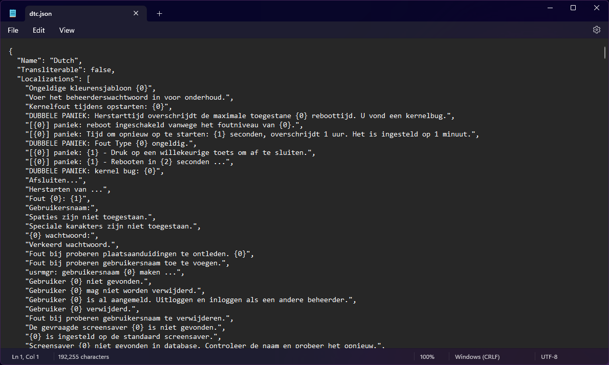

# Multilingual Kernel

The languages were introduced to the kernel to allow users who don't natively speak English or prefer their native language to use the kernel. This page explains the inner workings of the multilingual kernel.

## JSON file format

<figure><figcaption></figcaption></figure>

The kernel languages use the JSON localization files that store the following information:

* `Name`: The name of the language
  * The type of this variable is a **string**
* `Transliterable`: Whether the language contains the `-T` variant or not (transliterated vs. translated)
  * The type of this variable is a **boolean**
* `Localizations`: Contains translated strings
  * The type of this variable is an **array** of **strings**


The source of the generated JSON files come from `Nitrocid.Locales`, a tool shipped with the kernel.


## Translation

Before the translation process, the language manager needs to know what are the defined languages, including the custom ones. This processing is done by calling the `LanguageManager.Languages` property under the `KS.Languages` namespace.

The translation function, `Translate.DoTranslation()`, checks to see if the language exists by calling the above property and checking for the language key to see if it exists. If it's found, and the translation is needed (`eng` is not a current language), it calls the `LanguageInfo` version.

Finally, the overloaded function checks to see if the string is found within the translated strings. If it found one, it returns the translated string. Else, it surrounds the string with the `((` and the `))` signs to indicate that the locale data for this string is missing.


When the user is logged in, the kernel checks for preferred language value defined in the user configuration file.

If `preferredlanguage` is not defined, it'll fallback to the kernel language. Else, it uses the user preferred language.


To learn more about custom languages and how they work, click on the button below:


[custom-languages.md](custom-languages.md)


### `LocalizedString` struct

The `LocalizedString` struct allows you to easily store both the original untranslated text and the localized translated text. You can easily create a new instance of this struct by casting it either implicitly or explicitly to a string.

```csharp
// Implicit cast from the string
LocalizedString locStr1 = "Hello!";

// Explicit cast from the string
LocalizedString locStr2 = (LocalizedString)"Hello!";

// Using the constructor
LocalizedString locStr3 = new("Hello!");
```

The struct contains the following properties:

* `Original`: The original string that was passed to the constructor
* `Localized`: The string that is localized to the current language

You can get the localized string by either using the `ToString()` function, by getting the value of `Localized` property, or by casting the struct either implicitly or explicitly to a string.

```csharp
// Using the ToString() function
string locStrRes1 = locStr1.ToString();

// Using the Localized property
string locStrRes2 = locStr1.Localized;

// Using implicit and explicit casting
string locStrRes3 = locStr1;
string locStrRes4 = (string)locStr1;
```


This is useful when defining variables that don't necessarily get regenerated dynamically. You should still use those variables to get the translated versions, given that those variables already provide fields or properties that use this struct.

