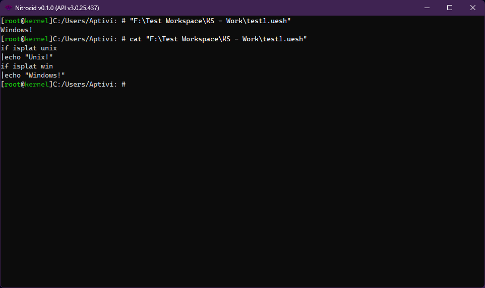
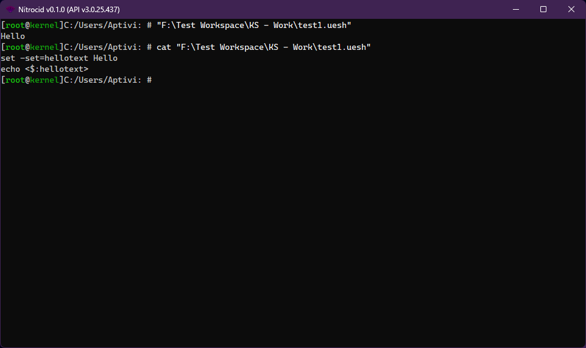

# Shell Scripting

<figure><figcaption></figcaption></figure>

UESH shell contains scripting support. The shell scripts have the `.uesh` extension containing a subset of UESH commands inside it. A simple UESH script containing a command that sets a UESH variable is as follows:

```
set -set=hellotext Hello
echo <$:hellotext>
```

## Script parser

When this script file is executed, the UESH script parser skims the file for any possible `$variables` and initializes them with their default values using the `UESHVariables.InitializeVariable` function.

The parser then attempts to skim the script lines for all the variables, and replaces them with the value. The parser also attempts to parse the script argument placeholders, defined with `{num}`; which `num` is the argument number, in case the ︎user executed the script with the arguments. For example, this script prints the first argument:

```
echo {0}
```

As soon as the parsing is done, the final line gets executed by the `GetLine()` command.

## Variables

<figure><figcaption></figcaption></figure>

UESH provides the variable facility, which holds the variable as a key and the variable value as a value. Each variable starts with the dollar sign like `$var`, regardless of the platform.

When a variable gets initialized by `InitializeVariable()`, the variable name gets sanitized (`SanitizeVariableName()`) by appending the dollar sign in front of the variable name, which then gets initialized with the empty value.

The variable can be read from and written to by these respective functions: `GetVariable()` and `SetVariable()`. These can be used by your mods. Additionally, an array of values can be initialized with one variable by `SetVariables()` to initialize `$var[n]` variables, which:

* `var`: A variable name
* `n`: How many values are there (count from 0)

When the kernel starts up, `ConvertSystemEnvironmentVariables()` queries the operating system for environment variables and sets them one by one to the UESH variable store. Its list can be obtained by the `GetVariables()` function.


Additionally, the variables can be uninitialized by the `RemoveVariable()` function. When the target variable is removed, it has to be re-initialized before it can be used again.


## Conditions

No scripting is complete with conditions, which control the execution of the command. These conditions are currently available to be used: (`<value>` can either be a constant or a UESH `$variable`)

* `eq`: The value is equal to the value
  * Usage: `<value> eq <value>`
* `neq`: The value is not equal to the value
  * Usage: `<value> neq <value>`
* `les`: The number is less than another number
  * Usage: `<value> les <value>`
* `lesoreq`: The number is less than or equal to another number
  * Usage: `<value> lesoreq <value>`
* `gre`: The number is greater than another number
  * Usage: `<value> gre <value>`
* `greoreq`: The number is greater than or equal to another number
  * Usage: `<value> greoreq <value>`
* `fileex`: The file exists
  * Usage: `fileex <value>`
* `filenex`: The file doesn't exist
  * Usage: `filenex <value>`
* `direx`: The directory exists
  * Usage: `direx <value>`
* `dirnex`: The directory doesn't exist
  * Usage: `dirnex <value>`
* `has`: The specified string contains a substring
  * Usage: `<value> has <value>`
* `hasno`: The specified string doesn't contain a substring
  * Usage: `<value> hasno <value>`
* `ispath`: The specified path is valid
  * Usage: `<value> ispath`
* `isnotpath`: The specified path is invalid
  * Usage: `<value> isnotpath`
* `isfname`: The specified file name is valid
  * Usage: `<value> isfname`
* `isnotfname`: The specified file name is invalid
  * Usage: `<value> isnotfname`
* `sane`: The hash matches the expected hash
  * Usage: `<value> <value> sane`
* `insane`: The hash doesn't match the expected hash
  * Usage: `<value> <value> insane`
* `fsane`: The file hash matches the expected hash
  * Usage: `<value> <value> fsane`
* `finsane`: The file hash doesn't match the expected hash
  * Usage: `<value> <value> finsane`
* `is`: The variable is of the appropriate type
  * Usage: `<value> is <type>`
* `isnot`: The variable is not of the appropriate type
  * Usage: `<value> isnot <type>`
* `isplat`: The host is running a selected platform
  * Usage: `isplat <platform>`
* `isnotplat`: The host is not running a selected platform
  * Usage: `isnotplat <platform>`


`<type>` can be one of the following:

* `null`
* `string, fullstring`
* `numeric`
* `byte, i8, ubyte, u8`
* `int16, short, i16, uint16, ushort, u16`
* `int32, integer, i32, uint32, uinteger, u32`
* `int64, long, i64, uint64, ulong, u64`
* `float, f32, double, f64, decimal`
* `bool`
* `regex`

`<platform>` can be one of the following:

* `win`: Windows platforms (Windows 10, 11, ...)
* `mac`: Macintosh platforms (macOS Catalina, Big Sur, ...)
* `unix`: Unix flavors (Linux, ...)
* `android`: Android phones and tablets (Android 13, 14, ...)


### Implementation

The conditions all have their base condition class and their interface to be implemented like below:

```csharp
public class YourCondition : BaseCondition, ICondition
```

Basically, you must override all the variables, where:

* `ConditionName`: A condition name without spaces to be included in the expression

```csharp
public override string ConditionName => "dirnex";
```

* `ConditionPosition`: Which word number starting from 1 should the expression be found?

```csharp
public override int ConditionPosition { get; } = 1;
```

* `ConditionRequiredArguments`: How many arguments are required? Starting from 1.

```csharp
public override int ConditionRequiredArguments { get; } = 2;
```

Choose one of the two method overloads to override, depending on your condition:

* `IsConditionSatisfied(string FirstVariable, string SecondVariable)`
  * This function checks the two variables to see if they satisfy a condition

```csharp
public override bool IsConditionSatisfied(string FirstVariable, string SecondVariable)
```

* `IsConditionSatisfied(string[] Variables)`
  * This function checks any number of variables to see if they satisfy a condition

```csharp
public override bool IsConditionSatisfied(string[] Variables)
```

You can call `ConditionSatisfied()` to test any built-in or custom condition. Give it any expression and test it with `true`.


The `if` command in the UESH shell is a major contributor to the condition system, though it can be changed in the future.


### Conditional blocks and Loops

The conditional blocks and loops are one of the most essential scripting features that control the script flow based on the conditions and conditional loops. These are currently supported:

* `if <condition>`
* `while <condition>`
* `until <condition>`

After the script parser detects one of these, it checks for the new block stack in the next line, like this:

```
if $test2 eq y
|set $test3 n
```


The new block stack must be defined with one extra `|` character directly after lines that start with one of the above conditional block statements. Otherwise, parsing will fail.


If defined correctly, the script parser walks through the commands defined in the new stack. However, if the condition is not satisfied, the whole block stack for the first conditional block that doesn't satisfy the condition will be skipped and the parser will continue executing commands that are defined in the current stack. For example, consider this:


```
choice -m $test2 y/n "Found any bugs?"
if $test2 eq y
|set $test3 n
|until $test3 eq y
||choice -m $test3 y/n "Exit?"
||echo Current: $test3
|echo out of until
echo out of if
```


This script first checks to see if the user has answered `y` in the first line. The following will happen:

* If the user answered `y`, the script parser enters the new stack defined by the `if` condition in line 2.
* If the user answered `n`, the script parser skips the new stack defined by the `if` condition and continues parsing the commands from line 8.

`while` and `until` blocks require the new stack to be defined. In addition to this, the script parser checks to see if the condition is no longer satisfied after the stack that these blocks defined.

* If the condition is satisfied, the commands after the `while` or `until` blocks get executed.
* If the condition is not satisfied, the commands after the `while` or `until` blocks get skipped and the script parser continues parsing the commands.

### Custom conditions

Custom conditions are mod-defined conditions that customize the way that you define the conditions and how you want the condition to be satisfied. Your typical condition class file looks like this:


```csharp
using Nitrocid.Scripting.Conditions;

public class MyCondition : BaseCondition, ICondition
{
    public override string ConditionName => "custom";
    public override int ConditionPosition { get; } = 2;
    public override int ConditionRequiredArguments { get; } = 3;

    public override bool IsConditionSatisfied(string FirstVariable, string SecondVariable)
    {
        // Your condition satisfying code here (for one or two variables)
        // return true;
    }
    
    public bool IsConditionSatisfied(string[] Variables)
    {
        // Your condition satisfying code here (for more than two variables, counting from zero)
        // return true;
    }
}
```


To register your condition, you must call `UESHConditional.RegisterCondition()` in your mod initialization code to add your condition with your needed code to the list of custom conditions. After that, the UESH script parser will be able to parse your custom condition.

To unregister your condition, you must call `UESHConditional.UnregisterCondition()` in your mod cleanup code to remove your condition from the list of custom conditions. After that, you won't be able to use scripts that use your custom condition.

### Error codes

The error code variable, `UESHErrorCode`, holds information about the last process error code, whether it's a success (a zero value) or a failure (non-zero value). Currently, these values are supported:

#### Error codes that come from the parser

* `0`
  * Indicates success
* `-1`
  * Indicates that the command is not found
* `-2`
  * Indicates that the command is not found and that the file is not found under any path lookup directories
* `-3`
  * Indicates that the command is attempting to be run in maintenance mode and the command forbids that
* `-4`
  * Indicates that the command is a strict command and the user doesn't have permissions to execute it

#### Error codes that come from the commands

* `0`
  * Indicates success
* `-5`
  * Indicates that the command is interrupted unexpectedly
* `-6`
  * Indicates that the user didn't provide required arguments
* `Exception.GetHashCode()`
  * Some commands throw this value from any exception. Indicates that the command failed to perform its operation.
* `10000 + KernelExceptionType`
  * Some commands throw this value from any `KernelException` that is thrown by the command executor. Indicates that the command failed to perform its operation, but the kernel already knows about it.
  * Example: If `KernelExceptionType.Config` is thrown from the command executor, and the command knows how to return this exception as an error code, such as using `KernelExceptionTools.GetErrorCode()`, then it'll return the sum of `10000 + 7`, which is `10007`.

#### Command-specific error codes

* `1`
  * Indicates that the command answered `n` to the confirmation (FTP and SFTP's `del` command)
* `2`
  * Indicates that either the real or the imaginary number is not valid (`imaginary` command)
* `3`
  * Indicates that the unit type is not found (`unitconv` command)
* `4`
  * Indicates that the hashes don't match (`verify` command)
* `5`
  * Indicates that the version code can't be formed (`version` command)
  * Indicates that the action taken is invalid (`todo` command)
* `6`
  * Indicates that the version code can't be formed (`platform` command)
* `7`
  * Indicates that the line endings converter can't convert binary files (`convertlineendings` command)
* `8`
  * Indicates that the note number is not numeric (`removenote` command)
* `9`
  * Indicates that the repository has been modified (`checkout` command)
* `10`
  * Indicates that the branch doesn't exist (`checkout` command)
* `11`
  * Indicates that the repository has been modified (`fetch` command)
* `12`
  * Indicates that the remote doesn't exist (`fetch` command)
* `13`
  * Indicates that there are no remotes to pull updates from (`fetch` command)
* `14`
  * Indicates that you need to identify yourself (`pull` command)
* `15`
  * Indicates that you need to identify yourself (`maketag` and `commit` command)
* `16`
  * Indicates that the culture is not found (`altdate` command)
* `17`
  * Indicates that there is no such lyric file (`playlyric` command)
* `18`
  * Indicates that the number of times is invalid (`repeat` command)
* `19`
  * Indicates that `repeat` can't repeat itself (`repeat` command)
* `20`
  * Indicates that the number of columns is invalid (`wraptext` command)
* `21`
  * Indicates that the extension handler is not registered (`getdefaultexthandler` command)
* `22`
  * Indicates that the extension handler is not registered (`getexthandlers` command)
* `23`
  * Indicates that the extension is not registered (`setexthandler` command)
* `24`
  * Indicates that the extension implementer is not registered (`setexthandler` command)
* `25`
  * Indicates that the port number is invalid (`netfminfo` command)
* `26`
  * Indicates that the number of seconds or the drink name is invalid (`caffeine` command)
* `27`
  * Indicates that there is no such lyric file (`lyriclines` command)
* `28`
  * Indicates that there is no config or key (`getconfigvalue`, `setconfigvalue`, and `lsconfigvalues` command)
* `29`
  * Indicates that the music file is not found (`playsound` command)
* `30`
  * Indicates that the MPG123 library has timed out (`playsound` command)
  * Indicates that the music file is not specified (`musicplayer` command)
* `31`
  * Indicates that the music file is not found (`musicplayer` command)
* `32`
  * Indicates that there are no caffeine alerts to abort (`caffeine` command)
* `33`
  * Indicates that this command is not supported on Windows (`showmainbuffer` command)
* `34`
  * Indicates that the dock is not found (`dock` command)
