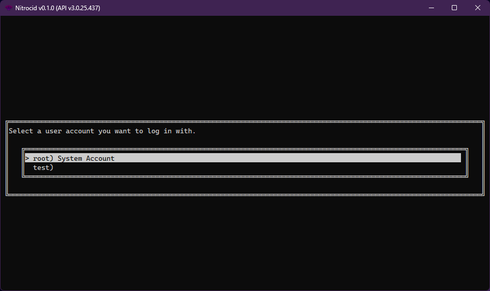
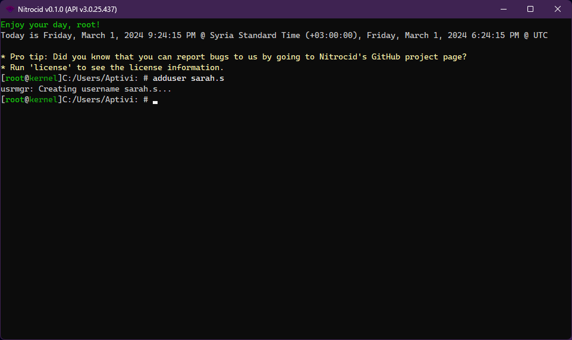
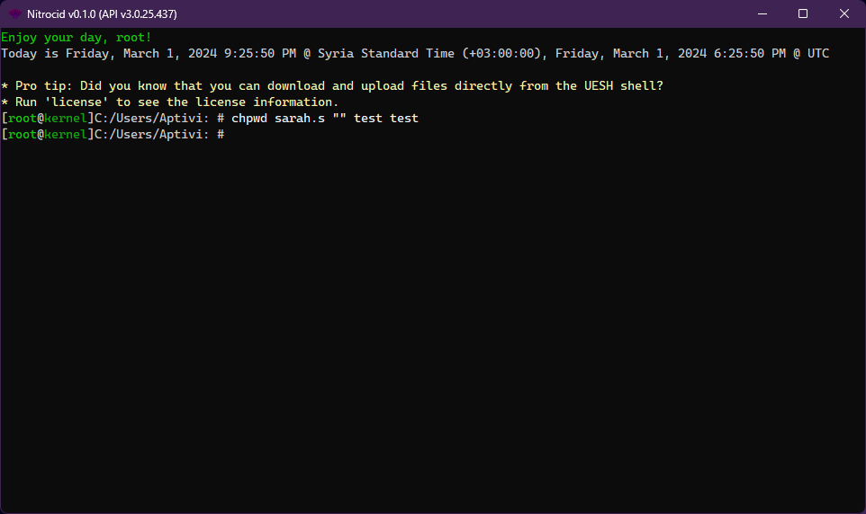
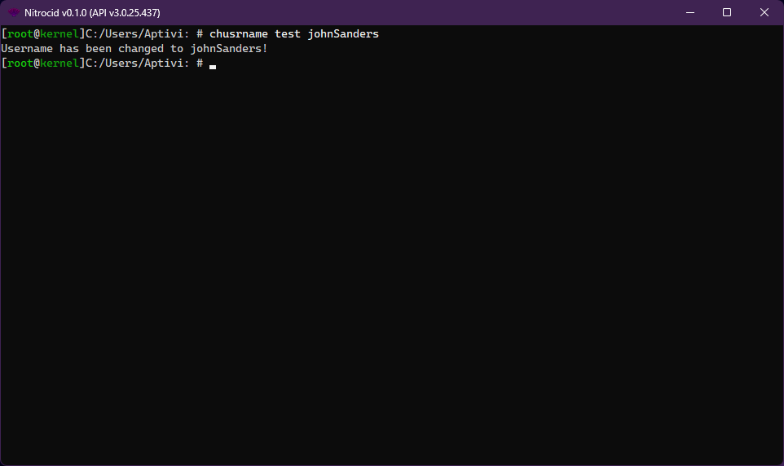
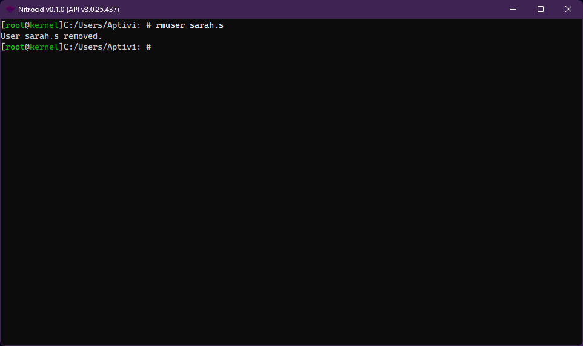
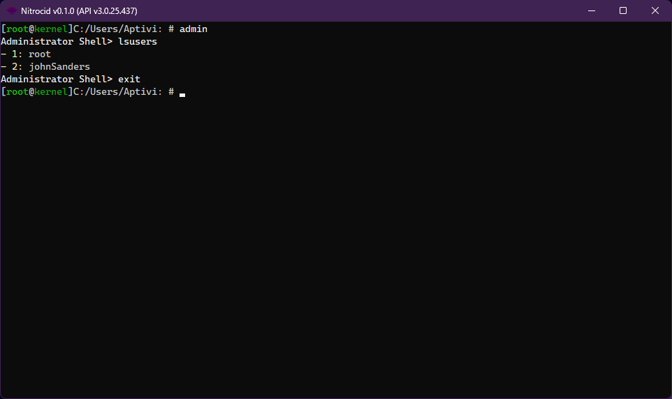
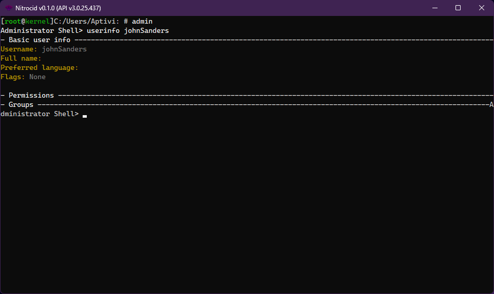

# Accounts

<figure><figcaption></figcaption></figure>

Operating systems usually provide the user account functionality to allow more than one person to use the same computer. Each person has their own accounts on their computers to store their personal information and data, including their user profiles and their contents.

The concept of accounts in the kernel is to provide the same functionality, but the simulator only simulates the user accounts, not their home paths. Like all the operating systems, the simulator can manage all the user accounts.

## Manipulation

The operations can be performed on the users to manage them. Scroll down to the section you want.

### Add user accounts

<figure><figcaption></figcaption></figure>

In the real-world, if there is a new person willing to use your computer to store their personal documents and information, you can add such user to the computer. This can be done by going to your system's settings to add the user.

The same thing can be simulated in Nitrocid KS. To add a new user account, follow these steps:

1. Log-in to the system account, root, or any of the administrators or users that has at least the user management permission
2. Execute the `adduser` command to make a new user. The username is needed to be able to create your new user.
   * The full usage of the `adduser` command is `adduser <user> [pass] [confirmpass]`
3. Log out of the user and log-in to the new user


Note that your account must have either the administrative permissions enabled or the user management permission granted to be able to use this command.


### Change your password

<figure><figcaption></figcaption></figure>

In case you need to change your password to something more secure, or you need to add your password, you'll go to the user account section of the system settings to add or change your password.

In the simulated kernel, there is a command dedicated to changing the user password. You can use this command to perform this operation.

1. Log-in to the system account, root, or any of the administrators or users that has at least the user management permission
2. Execute the `chpwd` command to change the password. If you want to add the password to a user, leave the `UserPass` argument blank
   * The full usage of the `chpwd` command is `chpwd <Username> <UserPass> <newPass> <confirm>`
3. Log out of the user and log-in to the new user with the new password


Note that your account must have either the administrative permissions enabled or the user management permission granted to be able to use this command.


### Rename your user

<figure><figcaption></figcaption></figure>

If you want to rename your own user, or if you accidentally made a typo in someone else's username and you want to change it to the right name, you can use the user management portion of the operating system to rename the affected user.

The simulated kernel simulates this functionality using the `chusrname` command. To use it, follow these steps:

1. Log-in to the system account, root, or any of the administrators or users that has at least the user management permission
2. Execute the `chusrname` command to change the username
   * The full usage of the `chusrname` command is `chusrname <oldUserName> <newUserName>`
3. Log out of the user and log-in to the new user


Note that your account must have either the administrative permissions enabled or the user management permission granted to be able to use this command.


### Remove a user

<figure><figcaption></figcaption></figure>

If the person or a user no longer wants to use your computer, or if they're migrating their data from your computer to their brand-new PC, you can remove their user and all their data associated with it.

The simulated kernel simulates the user removal function. Follow these steps to remove a user from the kernel:

1. Log-in to the system account, root, or any of the administrators or users that has at least the user management permission
2. Execute the `rmuser` command to remove the user
   * The full usage of the `rmuser` command is `rmuser <Username>`
3. Log out of the user and log-in to the new user with the new password


Note that your account must have either the administrative permissions enabled or the user management permission granted to be able to use this command.


### List existing users

<figure><figcaption></figcaption></figure>

If you want to get a list of available usernames that the kernel recognized, you can no longer have to log out of your account to see the list. In the real-world systems, you can get a list of accounts by going to the users section of the system settings. Follow these steps to get the list:

1. Log-in to any administrator account
2. Open the administration shell by executing the `admin` command
3. Execute the `lsusers` command


Note that your account must have either the administrative permissions enabled or the user management permission granted to be able to use this command.


### Get user information

<figure><figcaption></figcaption></figure>

If you want to get information about a user without having to open the user settings file found in your kernel configuration file, follow the steps:

1. Log-in to any administrator account
2. Open the administration shell by executing the `admin` command
3. Execute the `userinfo [user]` command

## User Groups

User groups organize users into a group. You can learn more about it by clicking on the below button:


[groups.md](groups.md)


## Permissions

All users have specific permissions. To get more information about this feature, click on the link below.


[permissions.md](permissions.md)

