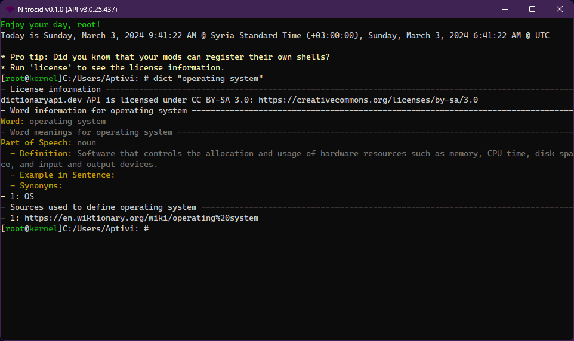

# Dictionary

<figure><figcaption></figcaption></figure>

Nitrocid KS features a dictionary supplied as a separate addon to allow you to get a definition of an English word. You can define a word of your choice, as long as it's found in the back end, which is the [Free Dictionary API](https://dictionaryapi.dev/).


`dictionaryapi.dev` API is licensed under [CC BY-SA 3.0](https://creativecommons.org/licenses/by-sa/3.0).


This feature can be used by executing the `dict` command, passing it a word that you want to define, such as `hello` or `goodbye`. The dictionary command provides you with the following information:

* Word
* Word meaning
  * Part of speech
  * Definition
  * Example in sentence
  * Meaning-based synonyms
  * Meaning-based antonyms
* Base synonyms
* Base antonyms

The availability of said information can vary, depending on a word and on a part of speech used in various meanings.
