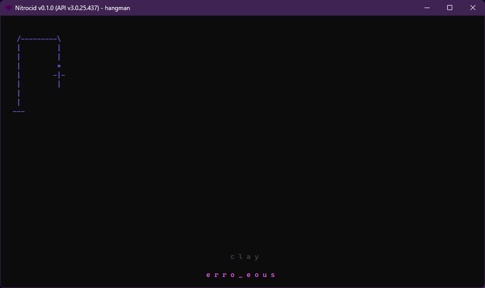

# Hangman

<figure><figcaption></figcaption></figure>


As of 0.1.0, this feature has been moved to the kernel addons.


The famous Hangman game! It lets you guess what characters are in a word. You have six chances to select the right letter, or you're hung! If you managed to guess all the letters right, you're free from the hanger!

## Controls

* `Any key`: Submits a letter
* `ESC`: Forfeits from the game

## Difficulties

* Normal (`hangman`): Six attempts max
* Hardcore (`hangman -hardcore`): One attempt max
* Practice (`hangman -practice`): Unlimited attempts
