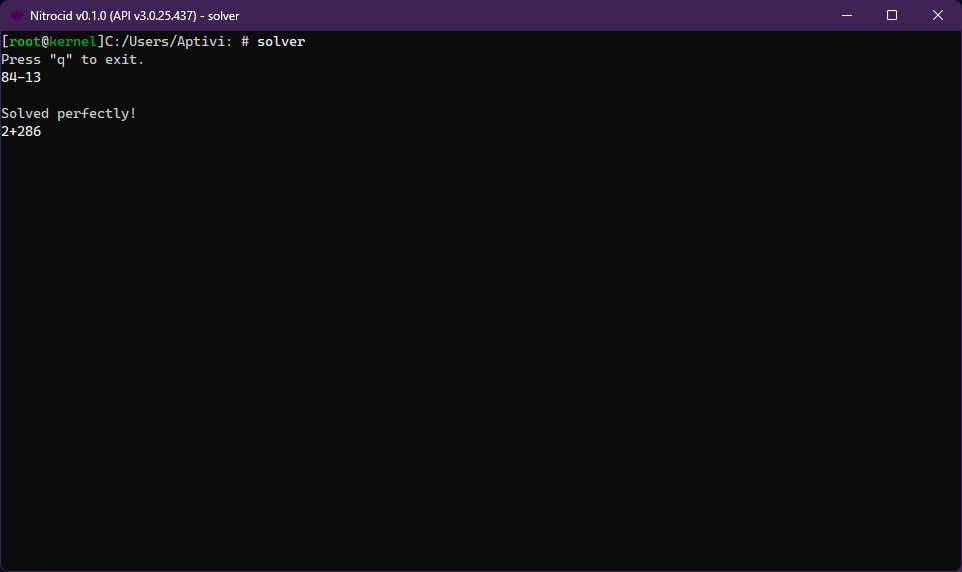

# Solver

<figure><figcaption></figcaption></figure>


As of 0.1.0, this feature has been moved to the kernel addons.


Can you solve the printed mathematical expressions on time? Test your speed in solving the exercises ranging from low to high difficulty.

## Controls

* `ENTER`: To submit your response
* `Q`, then `ENTER`: Exit the game
